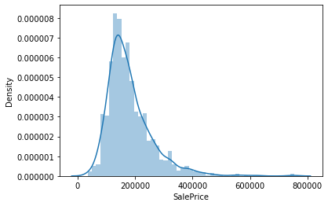
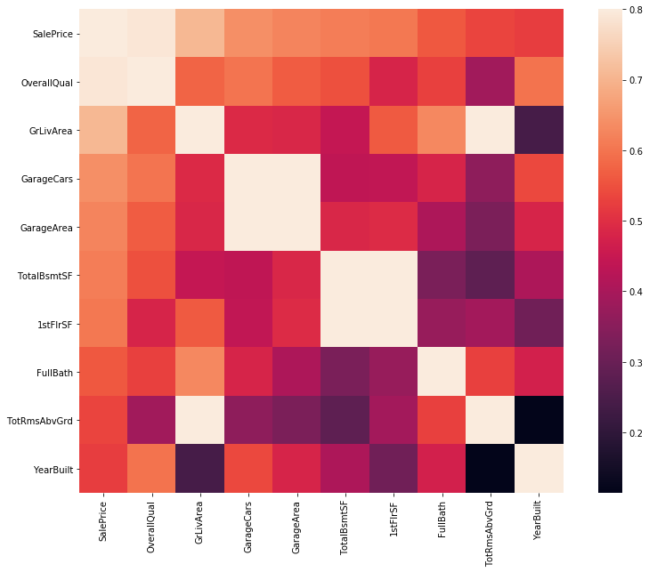
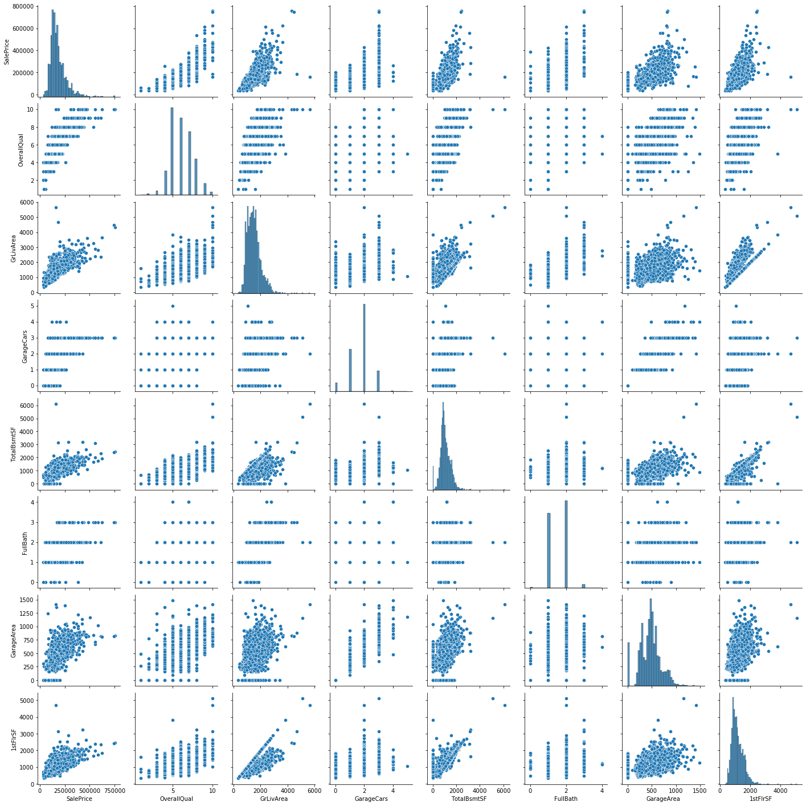
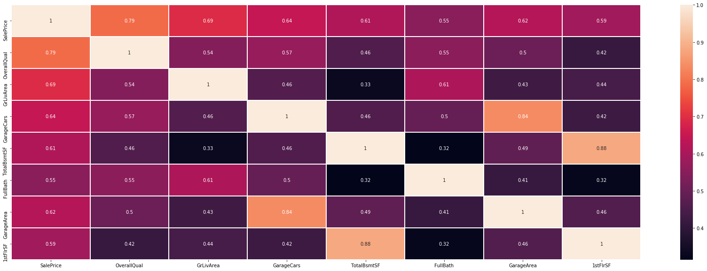
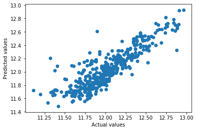

# House-Price-Prediction-Using-ML
# Step 1: Import Libraries


```python

import sys
!{sys.executable} -m pip install --upgrade pip --user
!{sys.executable} -m pip install xlrd
!{sys.executable} -m pip install statsmodels
!{sys.executable} -m pip install requests
!{sys.executable} -m pip install seaborn
!{sys.executable} -m pip install scikit-learn
```

    Requirement already satisfied: pip in ./.local/lib/python3.8/site-packages (20.3.3)
    Defaulting to user installation because normal site-packages is not writeable
    Requirement already satisfied: xlrd in /usr/lib/python3/dist-packages (1.1.0)
    Defaulting to user installation because normal site-packages is not writeable
    Requirement already satisfied: statsmodels in ./.local/lib/python3.8/site-packages (0.12.1)
    Requirement already satisfied: numpy>=1.15 in /usr/lib/python3/dist-packages (from statsmodels) (1.17.4)
    Requirement already satisfied: patsy>=0.5 in ./.local/lib/python3.8/site-packages (from statsmodels) (0.5.1)
    Requirement already satisfied: pandas>=0.21 in /usr/lib/python3/dist-packages (from statsmodels) (0.25.3)
    Requirement already satisfied: scipy>=1.1 in /usr/lib/python3/dist-packages (from statsmodels) (1.3.3)
    Requirement already satisfied: six in ./.local/lib/python3.8/site-packages (from patsy>=0.5->statsmodels) (1.15.0)
    Defaulting to user installation because normal site-packages is not writeable
    Requirement already satisfied: requests in /usr/lib/python3/dist-packages (2.22.0)
    Defaulting to user installation because normal site-packages is not writeable
    Requirement already satisfied: seaborn in ./.local/lib/python3.8/site-packages (0.11.0)
    Requirement already satisfied: scipy>=1.0 in /usr/lib/python3/dist-packages (from seaborn) (1.3.3)
    Requirement already satisfied: pandas>=0.23 in /usr/lib/python3/dist-packages (from seaborn) (0.25.3)
    Requirement already satisfied: matplotlib>=2.2 in /usr/lib/python3/dist-packages (from seaborn) (3.1.2)
    Requirement already satisfied: numpy>=1.15 in /usr/lib/python3/dist-packages (from seaborn) (1.17.4)
    Defaulting to user installation because normal site-packages is not writeable
    Requirement already satisfied: scikit-learn in ./.local/lib/python3.8/site-packages (0.23.2)
    Requirement already satisfied: scipy>=0.19.1 in /usr/lib/python3/dist-packages (from scikit-learn) (1.3.3)
    Requirement already satisfied: joblib>=0.11 in ./.local/lib/python3.8/site-packages (from scikit-learn) (0.17.0)
    Requirement already satisfied: numpy>=1.13.3 in /usr/lib/python3/dist-packages (from scikit-learn) (1.17.4)
    Requirement already satisfied: threadpoolctl>=2.0.0 in ./.local/lib/python3.8/site-packages (from scikit-learn) (2.1.0)


```python
import shutil
import pandas as pd
import numpy as np
import scipy as sp
import seaborn as sns
import matplotlib.pyplot as plt
import os
import requests
import sklearn as sc
from zipfile import ZipFile
from sklearn.model_selection import train_test_split
from sklearn.linear_model import LinearRegression
import statsmodels.api as sm
```

# Downloading House Data


```python
r = requests.get('https://www.dropbox.com/s/1fcws6aaodry54n/partii.zip?dl=1', allow_redirects=True)
open('partii.zip', 'wb').write(r.content);
with ZipFile('partii.zip', 'r') as zipObj:
   zipObj.extractall('DATA')
shutil.rmtree('DATA/__MACOSX')
```


```python
df = pd.read_csv('DATA/house_dataset.csv').iloc[:,2:]
```

# Step 2: Exploratory Data Analysis (EDA)


```python
df.head()
```


<div>

<table border="1" class="dataframe">
  <thead>
    <tr style="text-align: right;">
      <th></th>
      <th>Id</th>
      <th>MSSubClass</th>
      <th>MSZoning</th>
      <th>LotFrontage</th>
      <th>LotArea</th>
      <th>Street</th>
      <th>Alley</th>
      <th>LotShape</th>
      <th>LandContour</th>
      <th>Utilities</th>
      <th>...</th>
      <th>PoolArea</th>
      <th>PoolQC</th>
      <th>Fence</th>
      <th>MiscFeature</th>
      <th>MiscVal</th>
      <th>MoSold</th>
      <th>YrSold</th>
      <th>SaleType</th>
      <th>SaleCondition</th>
      <th>SalePrice</th>
    </tr>
  </thead>
  <tbody>
    <tr>
      <th>0</th>
      <td>1461</td>
      <td>20</td>
      <td>RH</td>
      <td>80.0</td>
      <td>11622</td>
      <td>Pave</td>
      <td>NaN</td>
      <td>Reg</td>
      <td>Lvl</td>
      <td>AllPub</td>
      <td>...</td>
      <td>0</td>
      <td>NaN</td>
      <td>MnPrv</td>
      <td>NaN</td>
      <td>0</td>
      <td>6</td>
      <td>2010</td>
      <td>WD</td>
      <td>Normal</td>
      <td>NaN</td>
    </tr>
    <tr>
      <th>1</th>
      <td>1462</td>
      <td>20</td>
      <td>RL</td>
      <td>81.0</td>
      <td>14267</td>
      <td>Pave</td>
      <td>NaN</td>
      <td>IR1</td>
      <td>Lvl</td>
      <td>AllPub</td>
      <td>...</td>
      <td>0</td>
      <td>NaN</td>
      <td>NaN</td>
      <td>Gar2</td>
      <td>12500</td>
      <td>6</td>
      <td>2010</td>
      <td>WD</td>
      <td>Normal</td>
      <td>NaN</td>
    </tr>
    <tr>
      <th>2</th>
      <td>1463</td>
      <td>60</td>
      <td>RL</td>
      <td>74.0</td>
      <td>13830</td>
      <td>Pave</td>
      <td>NaN</td>
      <td>IR1</td>
      <td>Lvl</td>
      <td>AllPub</td>
      <td>...</td>
      <td>0</td>
      <td>NaN</td>
      <td>MnPrv</td>
      <td>NaN</td>
      <td>0</td>
      <td>3</td>
      <td>2010</td>
      <td>WD</td>
      <td>Normal</td>
      <td>NaN</td>
    </tr>
    <tr>
      <th>3</th>
      <td>1464</td>
      <td>60</td>
      <td>RL</td>
      <td>78.0</td>
      <td>9978</td>
      <td>Pave</td>
      <td>NaN</td>
      <td>IR1</td>
      <td>Lvl</td>
      <td>AllPub</td>
      <td>...</td>
      <td>0</td>
      <td>NaN</td>
      <td>NaN</td>
      <td>NaN</td>
      <td>0</td>
      <td>6</td>
      <td>2010</td>
      <td>WD</td>
      <td>Normal</td>
      <td>NaN</td>
    </tr>
    <tr>
      <th>4</th>
      <td>1465</td>
      <td>120</td>
      <td>RL</td>
      <td>43.0</td>
      <td>5005</td>
      <td>Pave</td>
      <td>NaN</td>
      <td>IR1</td>
      <td>HLS</td>
      <td>AllPub</td>
      <td>...</td>
      <td>0</td>
      <td>NaN</td>
      <td>NaN</td>
      <td>NaN</td>
      <td>0</td>
      <td>1</td>
      <td>2010</td>
      <td>WD</td>
      <td>Normal</td>
      <td>NaN</td>
    </tr>
  </tbody>
</table>
<p>5 rows × 81 columns</p>
</div>


```python
df['SalePrice'].describe()
```


    count      1460.000000
    mean     180921.195890
    std       79442.502883
    min       34900.000000
    25%      129975.000000
    50%      163000.000000
    75%      214000.000000
    max      755000.000000
    Name: SalePrice, dtype: float64


```python
numeric_features = df.select_dtypes(include=[np.number])
catagorical_features = df.select_dtypes(include="object")
print("No of Numerical Features ",len(numeric_features.columns))
print("No of catagorica Features ",len(catagorical_features.columns))
```

    No of Numerical Features  38
    No of catagorica Features  43


```python
sns.distplot(df['SalePrice']);
```

      warnings.warn(msg, FutureWarning)


    

    


Let’s have a more general view on the top 10 correlated features with the sale price:


```python
k = 10 #number of variables for heatmap
corrmat = df.corr()
cols = corrmat.nlargest(k, 'SalePrice')['SalePrice'].index
f, ax = plt.subplots(figsize=(14, 10))
sns.heatmap(df[cols].corr(), vmax=.8, square=True);
```


    

    


```python
cols = ['SalePrice', 'OverallQual', 'GrLivArea', 'GarageCars', 'TotalBsmtSF', 'FullBath','GarageArea','1stFlrSF']
sns.pairplot(df[cols])
plt.show()
```


    

    


# Do we have missing data?


```python
total = df.isnull().sum().sort_values(ascending=False)
percent = (df.isnull().sum()/df.isnull().count()).sort_values(ascending=False)
missing_data = pd.concat([total, percent], axis=1, keys=['Total', 'Percent'])
missing_data.head(20)
```


<div>

<table border="1" class="dataframe">
  <thead>
    <tr style="text-align: right;">
      <th></th>
      <th>Total</th>
      <th>Percent</th>
    </tr>
  </thead>
  <tbody>
    <tr>
      <th>PoolQC</th>
      <td>2909</td>
      <td>0.996574</td>
    </tr>
    <tr>
      <th>MiscFeature</th>
      <td>2814</td>
      <td>0.964029</td>
    </tr>
    <tr>
      <th>Alley</th>
      <td>2721</td>
      <td>0.932169</td>
    </tr>
    <tr>
      <th>Fence</th>
      <td>2348</td>
      <td>0.804385</td>
    </tr>
    <tr>
      <th>SalePrice</th>
      <td>1459</td>
      <td>0.499829</td>
    </tr>
    <tr>
      <th>FireplaceQu</th>
      <td>1420</td>
      <td>0.486468</td>
    </tr>
    <tr>
      <th>LotFrontage</th>
      <td>486</td>
      <td>0.166495</td>
    </tr>
    <tr>
      <th>GarageQual</th>
      <td>159</td>
      <td>0.054471</td>
    </tr>
    <tr>
      <th>GarageYrBlt</th>
      <td>159</td>
      <td>0.054471</td>
    </tr>
    <tr>
      <th>GarageFinish</th>
      <td>159</td>
      <td>0.054471</td>
    </tr>
    <tr>
      <th>GarageCond</th>
      <td>159</td>
      <td>0.054471</td>
    </tr>
    <tr>
      <th>GarageType</th>
      <td>157</td>
      <td>0.053786</td>
    </tr>
    <tr>
      <th>BsmtExposure</th>
      <td>82</td>
      <td>0.028092</td>
    </tr>
    <tr>
      <th>BsmtCond</th>
      <td>82</td>
      <td>0.028092</td>
    </tr>
    <tr>
      <th>BsmtQual</th>
      <td>81</td>
      <td>0.027749</td>
    </tr>
    <tr>
      <th>BsmtFinType2</th>
      <td>80</td>
      <td>0.027407</td>
    </tr>
    <tr>
      <th>BsmtFinType1</th>
      <td>79</td>
      <td>0.027064</td>
    </tr>
    <tr>
      <th>MasVnrType</th>
      <td>24</td>
      <td>0.008222</td>
    </tr>
    <tr>
      <th>MasVnrArea</th>
      <td>23</td>
      <td>0.007879</td>
    </tr>
    <tr>
      <th>MSZoning</th>
      <td>4</td>
      <td>0.001370</td>
    </tr>
  </tbody>
</table>
</div>


```python
clean_data=df[cols]
clean_data.quantile([0.0, 0.01, 0.05, 0.10, 0.25, 0.50, 0.75, 0.90, 0.95, 0.99, 1.0])
```


<div>
<style scoped>
    .dataframe tbody tr th:only-of-type {
        vertical-align: middle;
    }

</style>
<table border="1" class="dataframe">
  <thead>
    <tr style="text-align: right;">
      <th></th>
      <th>SalePrice</th>
      <th>OverallQual</th>
      <th>GrLivArea</th>
      <th>GarageCars</th>
      <th>TotalBsmtSF</th>
      <th>FullBath</th>
      <th>GarageArea</th>
      <th>1stFlrSF</th>
    </tr>
  </thead>
  <tbody>
    <tr>
      <th>0.00</th>
      <td>34900.00</td>
      <td>1.0</td>
      <td>334.00</td>
      <td>0.0</td>
      <td>0.00</td>
      <td>0.0</td>
      <td>0.00</td>
      <td>334.00</td>
    </tr>
    <tr>
      <th>0.01</th>
      <td>61815.97</td>
      <td>3.0</td>
      <td>675.42</td>
      <td>0.0</td>
      <td>0.00</td>
      <td>1.0</td>
      <td>0.00</td>
      <td>520.00</td>
    </tr>
    <tr>
      <th>0.05</th>
      <td>88000.00</td>
      <td>4.0</td>
      <td>861.00</td>
      <td>0.0</td>
      <td>455.25</td>
      <td>1.0</td>
      <td>0.00</td>
      <td>665.90</td>
    </tr>
    <tr>
      <th>0.10</th>
      <td>106475.00</td>
      <td>5.0</td>
      <td>923.80</td>
      <td>1.0</td>
      <td>600.00</td>
      <td>1.0</td>
      <td>240.00</td>
      <td>744.80</td>
    </tr>
    <tr>
      <th>0.25</th>
      <td>129975.00</td>
      <td>5.0</td>
      <td>1126.00</td>
      <td>1.0</td>
      <td>793.00</td>
      <td>1.0</td>
      <td>320.00</td>
      <td>876.00</td>
    </tr>
    <tr>
      <th>0.50</th>
      <td>163000.00</td>
      <td>6.0</td>
      <td>1444.00</td>
      <td>2.0</td>
      <td>989.50</td>
      <td>2.0</td>
      <td>480.00</td>
      <td>1082.00</td>
    </tr>
    <tr>
      <th>0.75</th>
      <td>214000.00</td>
      <td>7.0</td>
      <td>1743.50</td>
      <td>2.0</td>
      <td>1302.00</td>
      <td>2.0</td>
      <td>576.00</td>
      <td>1387.50</td>
    </tr>
    <tr>
      <th>0.90</th>
      <td>278000.00</td>
      <td>8.0</td>
      <td>2153.20</td>
      <td>3.0</td>
      <td>1614.00</td>
      <td>2.0</td>
      <td>758.00</td>
      <td>1675.00</td>
    </tr>
    <tr>
      <th>0.95</th>
      <td>326100.00</td>
      <td>8.0</td>
      <td>2464.20</td>
      <td>3.0</td>
      <td>1776.15</td>
      <td>2.0</td>
      <td>856.15</td>
      <td>1830.10</td>
    </tr>
    <tr>
      <th>0.99</th>
      <td>442567.01</td>
      <td>10.0</td>
      <td>2935.72</td>
      <td>3.0</td>
      <td>2198.30</td>
      <td>3.0</td>
      <td>1019.49</td>
      <td>2288.02</td>
    </tr>
    <tr>
      <th>1.00</th>
      <td>755000.00</td>
      <td>10.0</td>
      <td>5642.00</td>
      <td>5.0</td>
      <td>6110.00</td>
      <td>4.0</td>
      <td>1488.00</td>
      <td>5095.00</td>
    </tr>
  </tbody>
</table>
</div>


```python
low = .01
high = .99

quant_df = clean_data.quantile([low, high])
quant_df.head()
```


<div>
<style scoped>
    .dataframe tbody tr th:only-of-type {
        vertical-align: middle;
    }

    
</style>
<table border="1" class="dataframe">
  <thead>
    <tr style="text-align: right;">
      <th></th>
      <th>SalePrice</th>
      <th>OverallQual</th>
      <th>GrLivArea</th>
      <th>GarageCars</th>
      <th>TotalBsmtSF</th>
      <th>FullBath</th>
      <th>GarageArea</th>
      <th>1stFlrSF</th>
    </tr>
  </thead>
  <tbody>
    <tr>
      <th>0.01</th>
      <td>61815.97</td>
      <td>3.0</td>
      <td>675.42</td>
      <td>0.0</td>
      <td>0.0</td>
      <td>1.0</td>
      <td>0.00</td>
      <td>520.00</td>
    </tr>
    <tr>
      <th>0.99</th>
      <td>442567.01</td>
      <td>10.0</td>
      <td>2935.72</td>
      <td>3.0</td>
      <td>2198.3</td>
      <td>3.0</td>
      <td>1019.49</td>
      <td>2288.02</td>
    </tr>
  </tbody>
</table>
</div>


```python
clean_data = clean_data.loc[(clean_data["GrLivArea"] < quant_df.loc[high, "GrLivArea"])&
                            (clean_data["TotalBsmtSF"] > quant_df.loc[low, "TotalBsmtSF"]) &
                            (clean_data["TotalBsmtSF"] < quant_df.loc[high, "TotalBsmtSF"]) &
                            (clean_data["GarageArea"] > quant_df.loc[low, "GarageArea"]) &
                            (clean_data["GarageArea"] < quant_df.loc[high, "GarageArea"])&
                            (clean_data["1stFlrSF"] < quant_df.loc[high, "1stFlrSF"])&
                            (clean_data["SalePrice"] > quant_df.loc[low, "SalePrice"])&
                            (clean_data["SalePrice"] < quant_df.loc[high, "SalePrice"])]
```


```python
X = clean_data.loc[:, ["OverallQual","GrLivArea","GarageCars","TotalBsmtSF","FullBath","GarageArea","1stFlrSF"]]
y = np.log(clean_data["SalePrice"])
```


```python
plt.figure(figsize=(30,10))
sns.heatmap(clean_data.corr(), linewidth=1, annot=True)
plt.show()
```


    

    


## Preparing the data

### Feature scaling

We will do a little preprocessing to our data using the following formula (standardization):

$$x'= \frac{x - \mu}{\sigma}$$

where $\mu$ is the population mean and $\sigma$ is the standard deviation.


```python
X = (X - X.mean()) / X.std()
X = np.c_[np.ones(X.shape[0]), X] 
```


```python
x_train, x_test, y_train, y_test = train_test_split(X, y, test_size = 0.3, random_state = 50)
```

## Linear Regression

### Simple Linear Regression

Simple linear regression uses a traditional slope-intercept form, where $a$ and $b$ are the coefficients that we try to “learn” and produce the most accurate predictions. $X$ represents our input data and $Y$ is our prediction.

$$Y = bX + a$$


### Multivariable Regression

A more complex, multi-variable linear equation might look like this, where w represents the coefficients, or weights, our model will try to learn.

$$ Y(x_1,x_2,x_3) = w_1 x_1 + w_2 x_2 + w_3 x_3 + w_0$$

The variables $x_1, x_2, x_3$ represent the attributes, or distinct pieces of information, we have about each observation.


```python
lm = LinearRegression()
lm.fit(x_train, y_train)
print("Coefficients: ", lm.coef_)

result = lm.predict(x_test)
```

    Coefficients:  [ 0.          0.13065804  0.11642741  0.03006242  0.07691202  0.00802758
      0.03020288 -0.00485464]


```python
plt.scatter(y_test, result)
plt.xlabel("Actual values")
plt.ylabel("Predicted values")
```


    Text(0, 0.5, 'Predicted values')


    

    


```python
X2 = sm.add_constant(X)
est = sm.OLS(y, X2)
est2 = est.fit()
print(est2.summary())
```

                                OLS Regression Results                            
    ==============================================================================
    Dep. Variable:              SalePrice   R-squared:                       0.797
    Model:                            OLS   Adj. R-squared:                  0.796
    Method:                 Least Squares   F-statistic:                     725.0
    Date:                Wed, 16 Dec 2020   Prob (F-statistic):               0.00
    Time:                        01:25:48   Log-Likelihood:                 590.35
    No. Observations:                1298   AIC:                            -1165.
    Df Residuals:                    1290   BIC:                            -1123.
    Df Model:                           7                                         
    Covariance Type:            nonrobust                                         
    ==============================================================================
                     coef    std err          t      P>|t|      [0.025      0.975]
    ------------------------------------------------------------------------------
    const         12.0472      0.004   2818.002      0.000      12.039      12.056
    x1             0.1430      0.006     23.817      0.000       0.131       0.155
    x2             0.1062      0.006     17.373      0.000       0.094       0.118
    x3             0.0293      0.008      3.504      0.000       0.013       0.046
    x4             0.0752      0.010      7.718      0.000       0.056       0.094
    x5             0.0077      0.006      1.320      0.187      -0.004       0.019
    x6             0.0270      0.008      3.381      0.001       0.011       0.043
    x7            -0.0005      0.010     -0.054      0.957      -0.020       0.019
    ==============================================================================
    Omnibus:                      205.633   Durbin-Watson:                   2.029
    Prob(Omnibus):                  0.000   Jarque-Bera (JB):              515.814
    Skew:                          -0.857   Prob(JB):                    9.82e-113
    Kurtosis:                       5.570   Cond. No.                         6.30
    ==============================================================================
    
